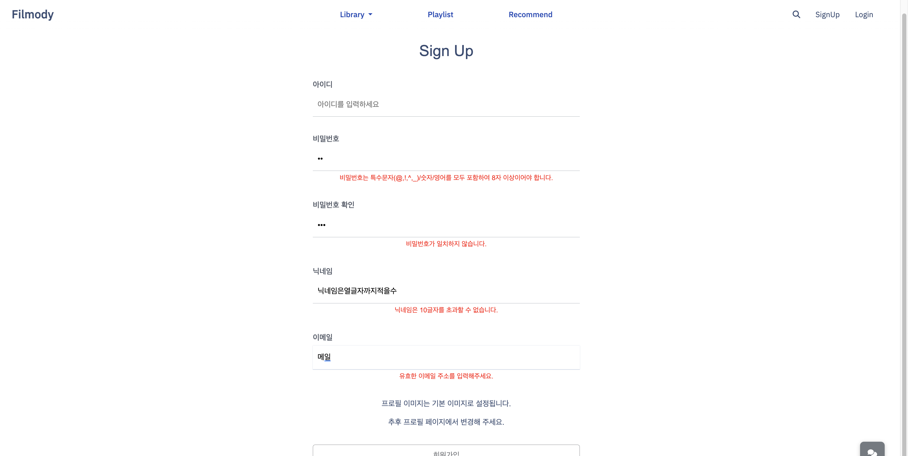

# filmody

film + melody

# 1. 프로젝트 소개

### 1) 개발 기간

   : 2024. 11. 15 ~ 2024 . 11. 26 (12일)

### 2) 개발 인원
  - 정주은
  - 윤지원

### 3) 프로젝트 내용

  - 영화 추천 및 관련 플레이리스트 생성 & 공유 웹 사이트

### 4) 기술 스택

# 2. 주요 기능
### 1) 회원가입

  - 회원가입 시 각 필드 유효성 검사 진행하도록 vue에서 처리

### 2) 로그인 

  - 유저 id와 password를 통해 로그인

### 3) 회원정보 수정

  - 프로필 페이지에서 접근 가능
  - 비밀번호 변경 외 필드는 변경시 비밀번호 요구하지 않음
  - 회원가입과 동일하게 유효성 검사
  - 리뷰 가리기 기능: 스포일러에 민감한 이용자를 위해 기능 구현(가입시 기본 활성화)
  - 회원 탈퇴 시 비밀번호 한 번 더 입력하도록 요구

### 4) 회원 탈퇴

  - 유저 password 검증을 통해 탈퇴처리

### 5) 유저 프로필 & 팔로우
  
  
  - 회원정보 수정 접근하는 버튼 위치
  - 활동 기록(좋아요한 영화/플레이리스트 내역, 만든 플레이리스트 표시)
  - 유저 팔로우 / 언팔로우 기능

### 6) 플레이리스트

  - 전체 목록 조회 가능 + 새 플레이리스트 생성 버튼 위치(비로그인 사용자에겐 보이지 않도록 설정)
  - 좋아요는 타인의 플레이리스트에 대해서만 가능
  - 플레이리스트 게시자(소유자)만 삭제 및 추가 가능하도록 권한 설정(타 이용자에게는 버튼 노출 X)
  - Youtube API 활용하여 플레이리스트 추가하도록 구현
  - 영상이 바로 재생되지 않도록 5초간의 딜레이 후 자동재생되도록 구현
  - API 데이터를 통해 곡이 끝나면 바로 다음 곡 자동재생

### 7) 플레이리스트 리뷰

  - 회원만 작성 가능하도록 설정
  - 내용 한 글자라도 작성해야 작성 버튼 활성화
  - 회원정보의 '리뷰 가리기' 활성화 여부에 따른 리뷰 가리기 기능 구현
  - 타인의 리뷰에 좋아요 가능
  - 리뷰의 작성자 정보를 통해 유저 상세프로필 접근 가능

### 8) 영화 추천

  - KOBIS / KMDB API 활용한 박스오피스 기준 영화 추천
  - 상위 10개의 영화 추천하며 각 카드를 통해 상세정보 조회 가능

### 9) 영화 상세정보 조회

  - KMDB API 활용하여 영화 상세정보 출력

### 10) 영화 검색

  - 감독명 또는 영화 제목으로 데이터 검색 가능

### 11) AI 영화 추천

  - Open AI API 활용하여 프론트 단위에서 응답 처리하도록 구성

# 11/19

- fixtures 데이터 만드는 데에 있어서 자꾸 environ 이 설치되어 있지 않다는 문구가 떴었습니다.
  환경 설정 문제로 같은 문제가 발생하면 환경변수 및 전역 설치 여부 등을 확인해야 한다는 것을 알았습니다.
- git push 전 제대로 동작하는 것 확인하고 올리기...!(중요)

- 플레이리스트 리뷰 모델
 class Meta:
        ordering = ['-created_at']
        unique_together = ['user', 'playlist']
        -> 이런식으로 하면 중복작성 불가능하게 제한 가능함..!

# 11/20
- fixtures 데이터 만들 때 만약 한 필드 내에 여러 요소가 있을 경우...
  해당 필드가 타 데이터의 외래키로 쓰일 때 오류난다
  외래키 -> many to many 필드로 전환하면 쉽게 해결 가능!
  대신 fixtures 해당 데이터를 배열 형태로 전환해줘야 한다
- 백엔드 구현에 문제가 없을 때 vue console에 html 내역이 넘어오는 경우...
  해당 데이터 받아오는 url에 문제 있을 가능성이 높음
- 로그인 새로고침 시 유지가 안될 때
  npm install vuex-persistedstate를 설치해주어야 한다.

  -----------------------------------------------------------------------------------------------------
  # 팀원 정보 및 업무 분담 내역
    정주은
    1. 로그인, 로그아웃 기능
    2. 회원가입 기능	정주은
    3. 영화 상세 목록 조회
    4. 영화 목록 조회
    5. 좋아요 기능
    6. 팔로우 기능
    7. 프로필 조회 기능
          
    윤지원
    1. 영화 데이터 (최소 50개 이상)	윤지원
    2. 영화 목록 조회
    3. 커뮤니티 게시글 기능
    4. 커뮤니티 댓글 기능
    5. 좋아요 기능	
    6. 영화 추천 알고리즘	윤지원
    7. AI (챗봇) 기능	윤지원
